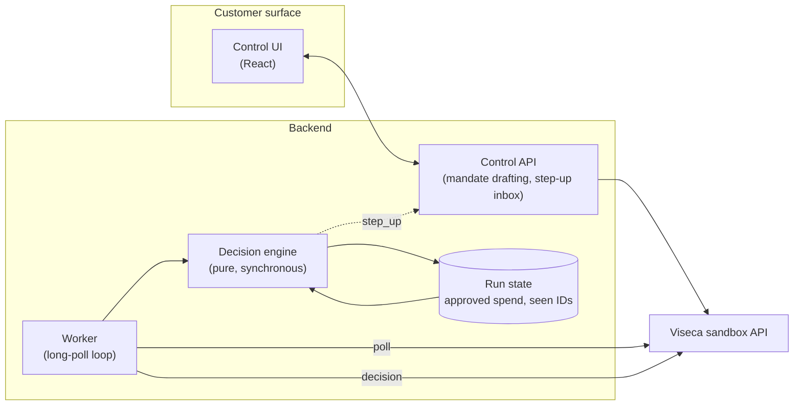

# Architecture

## Why the split

Viseca intends to integrate wallet-control configuration into the existing `one`
mobile app, while the approve/decline/ask decision runs in the backend under a
hard latency ceiling. Those two halves have opposite requirements — one is
interactive and can be redeployed freely, the other is a hot path measured in
milliseconds — so they are separate deployables that share only an HTTP contract.

The engine is a pure function of `(event, run state)` — no network, no clock
reads beyond what it is handed, no I/O. That is what makes it fast, testable
offline against all 45 attempts, and unable to be talked out of a decision by
anything a merchant writes.

## How a decision is produced

The stages run in order and the first one to reach a verdict wins. Every stage
appends to a shared evidence list, so the output explains itself.

1. **Parse and validate** the event against `authorization_event.schema.json`.
   A malformed event is never guessed at.
2. **Platform preconditions** — mandate status, authority status, card status.
   Anything not active is a `decline`; these are facts, not judgement calls.
3. **Sanitise merchant text.** Scan `item_details` and `purchase_description`
   for instructions aimed at an automated agent. Extract product facts. Record
   any injection attempt as a risk signal and strip it from anything downstream.
4. **Hard rules** from the confirmed mandate — per-purchase amounts, rolling
   period totals, categories, merchant constraints. A breach is a `decline`.
   Period totals count only *final approvals*; a purchase awaiting a human is
   not yet spend.
5. **Intent match** — does the basket actually contain what the customer asked
   for, on the terms they asked for? Unrequested add-ons, substitutions and
   category drift surface here.
6. **Session and behavioural signals** — device novelty, velocity, merchant
   familiarity from history, country, lookalike merchant names, duplicates
   against earlier purchases in this run.
7. **Resolve.** Clear pass with no open questions is an `approve`. A definite
   breach is a `decline`. Anything the engine cannot settle falls to the
   customer's own `uncertainty_policy` (`ask`, `decline`, or `approve`).

## Failure behaviour

| Failure | Behaviour |
| --- | --- |
| LLM slow, absent, or returns junk | Dropped. Stages 1-7 run unchanged and produce the decision. |
| Budget exhausted mid-evaluation | Return the safe verdict from the evidence gathered so far, never a timeout. |
| Repeated delivery of a purchase | Recognised by live `authorization_id`; the saved result is re-sent and spend is not double-counted. |
| Unparseable event | Escalate rather than guess. |

## State

The engine needs memory across a run: approved spend per rolling window, live
authorization IDs already answered, and the shape of earlier baskets so a
distinct-but-duplicate order can be caught. State is keyed by run and rebuilt
from the decision log, so a worker restart does not lose the leash.
