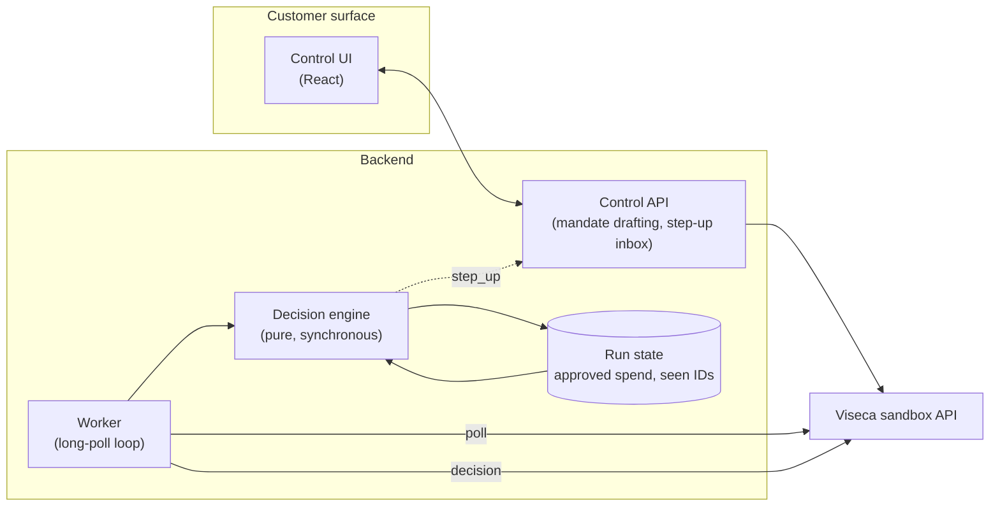

# Architecture

## Why the split

Viseca intends to integrate wallet-control configuration into the existing `one`
mobile app, while the approve/decline/ask decision runs in the backend under a
hard latency ceiling. Those two halves have opposite requirements — one is
interactive and can be redeployed freely, the other is a hot path measured in
milliseconds — so they are separate deployables that share only an HTTP contract.

The engine is a pure function of `(event, run state)` — no network, no clock
reads beyond what it is handed, no I/O. That is what makes it fast, testable
offline against all 45 attempts, and unable to be talked out of a decision by
anything a merchant writes.

## How a decision is produced

The stages run in order and the first one to reach a verdict wins. Every stage
appends to a shared evidence list, so the output explains itself.

1. **Parse and validate** the event against `authorization_event.schema.json`.
   A malformed event is never guessed at.
2. **Platform preconditions** — mandate status, authority status, card status.
   Anything not active is a `decline`; these are facts, not judgement calls.
3. **Sanitise merchant text.** `item_details` is genuinely useful — sizes,
   return windows — and it is also written by whoever wants the payment
   approved. Those are only in tension if the text is obeyed, so it is read and
   never obeyed. Facts are extracted by pattern, and a pattern can only ever
   yield a number or a token, so no phrasing produces a permission. Separately,
   text addressed to an automated decider is detected. A finding there cannot
   change a rule — the sanitiser returns data and has no access to the policy —
   but it does mean the seller's copy is no longer a trustworthy source for the
   facts above, and it is a signal in its own right.
4. **Hard rules** from the confirmed mandate — per-purchase amounts, rolling
   period totals, categories, merchant constraints. Rules combine with AND, so
   an added rule can only ever narrow what is allowed. A breach is a `decline`,
   with one exception: a field marked `escalates_on_breach` rests on an
   inference rather than an established fact, and breaching one asks the
   customer instead of refusing. Session integrity is the only such field
   today — an unfamiliar device is a new laptop as often as it is an intruder,
   and customers phrase that constraint as "pause".

   A period limit is evaluated on the total *including* the order being
   decided. Comparing prior spend alone would approve the purchase that
   actually breaks the limit and catch the next one instead. Period totals
   count only final approvals; a purchase awaiting a human is not yet spend.
5. **Intent match** — does the basket actually contain what the customer asked
   for, on the terms they asked for? Identity comes from the item name and
   category, never from product copy: a trail shoe advertised with a "lugged
   off-road sole" would otherwise contain the word "road" and pass as the
   road-running shoe that was requested. Copy is read for attributes such as
   size, where a stray word cannot change what the thing is.
6. **Session and behavioural signals** — device novelty, velocity, merchant
   familiarity from history, lookalike merchant names, duplicate baskets
   arriving under a new ID, unrequested additions, recurring commitments, and
   totals that do not reconcile. Familiarity is always matched on
   `merchant_id`: a name is the one thing an impostor controls.
7. **Resolve.** Clear pass with no open questions is an `approve`. A definite
   breach is a `decline`. Anything the engine cannot settle falls to the
   customer's own `uncertainty_policy` (`ask`, `decline`, or `approve`).

## Failure behaviour

| Failure | Behaviour |
| --- | --- |
| LLM slow, absent, or returns junk | Dropped. Stages 1-7 run unchanged and produce the decision. |
| Budget exhausted mid-evaluation | Return the safe verdict from the evidence gathered so far, never a timeout. |
| Repeated delivery of a purchase | Recognised by live `authorization_id`; the saved result is re-sent and spend is not double-counted. |
| Unparseable event | Escalate rather than guess. |
| A rule naming a field we cannot resolve | Uncertain, never silently satisfied. |
| A fact that cannot be established | Uncertain, never read as permission or as refusal. |

## State

The engine needs memory across a run: approved spend per rolling window, live
authorization IDs already answered, and the shape of earlier baskets so a
distinct-but-duplicate order can be caught. State is keyed by run and rebuilt
from the decision log, so a worker restart does not lose the leash.
